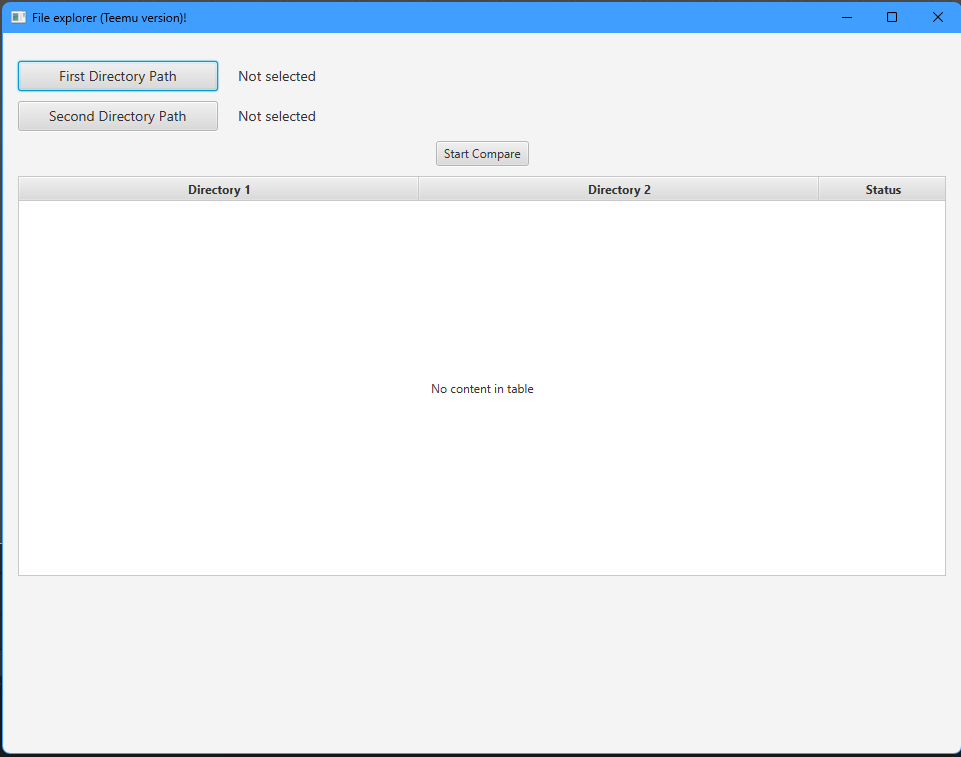
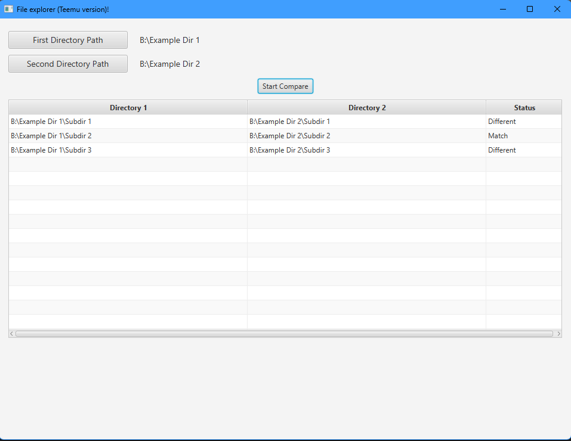

# FileExplorer

## Purpose
A small JavaFX desktop app that compares two directory trees and shows per-file results in a table. 

The UI lets the user pick two folders, run a comparison, and see each entry labeled: "Match" - if the dir/subdirs are the same in terms of name and size - or "Different".

### Initial screen

### After comparison

## How it works

The app scans both selected directories recursively, matches entries by relative path, computes their size and contained number of files, and shows if the directories and subdirectories match or are different.

## Key UI elements
- Two buttons to select directories and labels to show chosen paths.
- Start Compare button to run the comparison.
- TableView with columns Directory 1, Directory 2, Status showing per-entry results.

## Project structure (high level)

- MainController.java — JavaFX application entry point, handles UI actions and runs comparison logic.
- main-view.fxml — JavaFX FXML layout defining the UI structure.

## Requirements:
- JDK 17 (project targets Java 17).
- Maven (for building) 
- JavaFX dependencies configured in pom.xml.